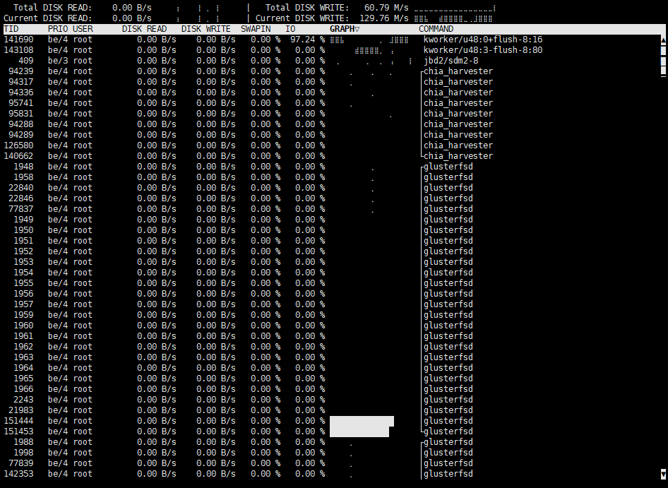

iotop
=====

Is your Linux server too slow or load is too high? One of the possible
causes of such symptoms may be high IO (input/output) waiting time,
which basically means that some of your processes need to read or write
to a hard drive while it is too slow and not ready yet, serving data for
some other processes.

Common practice is to use iostat -x in order to find out which block
device (hard drive) is slow, but this information is not always helpful.
It could help you much more if you knew which process reads or writes
the most data from your slow disk, so you could renice it using ionice
or even kill it.

iotop identifies processes that use high amount of input/output requests
on your machine. It is similar to the well known top utility, but
instead of showing you what consumes CPU the most, it lists
processes by their IO usage. Inspired by iotop Python script from
Guillaume Chazarain, rewritten in C by Vyacheslav Trushkin and improved
by Boian Bonev so it runs without Python at all.

iotop is licensed GPL-2.0+

[](https://repology.org/project/iotop-c/versions)

## Sample screenshot



## How to install from binary package

Many Linux distributions already include this program under the name iotop-c.

If you distribution is relatively new, chances are that it already have iotop packaged. Follow these instructions.

In case it is not available, follow the [How to build from source](#how-to-build-from-source) instructions.

<details>
  <summary>Debian/Devuan/Ubuntu/other derivatives</summary>
&nbsp;  

Use the following command (note that `-y` disables confirmation prompts):
  
    sudo apt install iotop-c -y
</details>

<details>
  <summary>Fedora</summary>
&nbsp;  

Use the following command (note that `-y` disables confirmation prompts):
  
    sudo dnf install iotop-c -y
</details>

<details>
  <summary>CentOS 7/CentOS 8/RHEL 7/RHEL 8</summary>
&nbsp;  

Use the following command (note that `-y` disables confirmation prompts):
    
    sudo yum install epel-release -y
    sudo yum install iotop-c -y
</details>


## How to build from source
Please note that the installation and the usage of this program require root access.

<details>
  <summary>Debian/Devuan/Ubuntu/other derivatives</summary>
&nbsp;  

Use the following commands (note that `-y` disables confirmation prompts):
  
    apt install git build-essential libncurses-dev pkg-config -y
    git clone https://github.com/Tomas-M/iotop
    cd iotop
    make -j
</details>

<details>
<summary>Fedora</summary>
&nbsp;  

Use the following commands (note that `-y` disables confirmation prompts):

    dnf install git gcc make ncurses-devel pkgconfig -y
    git clone https://github.com/Thomas-M/iotop
    cd iotop
    make -j
</details>

<details>
<summary>CentOS 7/CentOS 8/RHEL 7/RHEL 8</summary>
&nbsp;  

Use the following commands (note that `-y` disables confirmation prompts):

    yum install git gcc make ncurses-devel pkgconfig -y
    git clone https://github.com/Thomas-M/iotop
    cd iotop
    make -j
</details>


### How to install as a system command

sudo make install


### How to update to latest version

cd iotop && git checkout master && git pull && make clean && make -j


## Options


```
-v, --version         show program's version number and exit
-h, --help            show this help message and exit
-o, --only            only show processes or threads actually doing I/O
-b, --batch           non-interactive mode
-n NUM, --iter=NUM    number of iterations before ending [infinite]
-d SEC, --delay=SEC   delay between iterations [1 second]
-p PID, --pid=PID     processes/threads to monitor [all]
-u USER, --user=USER  users to monitor [all]
-P, --processes       only show processes, not all threads
-a, --accumulated     show accumulated I/O instead of bandwidth
-k, --kilobytes       use kilobytes instead of a human friendly unit
-t, --time            add a timestamp on each line (implies --batch)
-c, --fullcmdline     show full command line
-1, --hide-pid        hide PID/TID column
-2, --hide-prio       hide PRIO column
-3, --hide-user       hide USER column
-4, --hide-read       hide DISK READ column
-5, --hide-write      hide DISK WRITE column
-6, --hide-swapin     hide SWAPIN column
-7, --hide-io         hide IO column
-8, --hide-graph      hide GRAPH column
-9, --hide-command    hide COMMAND column
-q, --quiet           suppress some lines of header (implies --batch)
-H, --no-help         suppress listing of shortcuts
```


Contribute
==========

iotop was originally written by Vyacheslav Trushkin in 2014, distributed by Tomas Matejicek and later improved by Boian Bonev.

iotop is maintaned on GitHub at https://github.com/Tomas-M/iotop

The preferred way to contribute to the project is to file a pull request at GitHub.

Contacts of current maintainers are:

- Tomas Matejicek <tomas@slax.org>
- Boian Bonev <bbonev@ipacct.com>

Notable contributions (ordered by time of last contribution):

- EinProfiSpieler - README.md, build system improvements
- Paul Wise <pabs@debian.org> - Debian packaging, man page, multiple reviews and ideas
- Rumen Jekov <rvjekov@gmail.com> - Arch Linux packaging and testing
- Arthur Zamarin <arthurzam+gentoo@gmail.com> - Gentoo packaging and testing
- Yuriy M. Kaminskiy <yumkam@gmail.com> - code fixes and improvements
- alicektx <alicekot13@gmail.com> - documentation imrpovements
- Filip Kofron <filip.kofron.cz@gmail.com> - build system imrpovements

**Thanks! This project is what it is now because the steam you have put into it**

*NB. In case you have contributed to the project and do not see your name in the list, please note that the above list is updated manually and it is an omission - notify the maintainers to fix it.*
