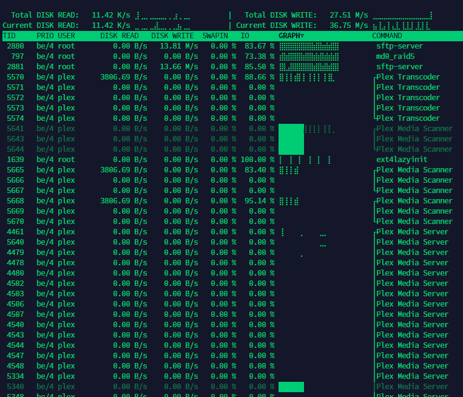

# iotop

Is your Linux server too slow or load is too high? One of the possible
causes of such symptoms may be high IO (input/output) waiting time,
which basically means that some of your processes need to read or write
to a hard drive while it is too slow and not ready yet, serving data for
some other processes.

Common practice is to use iostat -x in order to find out which block
device (hard drive) is slow, but this information is not always helpful.
It could help you much more if you knew which process reads or writes
the most data from your slow disk, so you could renice it using ionice
or even kill it.

iotop identifies processes that use high amount of input/output requests
on your machine. It is similar to the well known top utility, but
instead of showing you what consumes CPU the most, it lists
processes by their IO usage. Inspired by iotop Python script from
Guillaume Chazarain, rewritten in C by Vyacheslav Trushkin and improved
by Boian Bonev so it runs without Python at all.

iotop is licensed GPL-2.0+

## Sample screenshot

## How to install from binary package

Many Linux distributions already include this program under the name iotop-c.

If your distribution is relatively new, chances are that it already has iotop packaged. Follow these instructions.

In case it is not available, follow the [How to build from source](#how-to-build-from-source) instructions.

  
Debian/Devuan/Ubuntu/other derivatives

&nbsp;  

Use the following command (note that `-y` disables confirmation prompts):
  
    sudo apt install iotop-c -y

  
Fedora

&nbsp;  

Use the following command (note that `-y` disables confirmation prompts):
  
    sudo dnf install iotop-c -y

  
CentOS 7/CentOS 8/RHEL 7/RHEL 8/RHEL 9

&nbsp;  

Use the following commands (note that `-y` disables confirmation prompts):
    
    sudo yum install epel-release -y
    sudo yum install iotop-c -y

  
Void Linux

&nbsp;  

Use the following command:
    
    sudo xbps-install iotop-c

  
Arch Linux

&nbsp;  

Use the following command:
    
    sudo pacman -S iotop-c

## How to build from source
Please note that the installation and the usage of this program require root access.

  
Debian/Devuan/Ubuntu/other derivatives

&nbsp;  

Use the following commands (note that `-y` disables confirmation prompts):
  
    apt install git build-essential libncurses-dev libncursesw5-dev pkg-config -y
    git clone https://github.com/Tomas-M/iotop
    cd iotop
    make -j

Fedora

&nbsp;  

Use the following commands (note that `-y` disables confirmation prompts):

    dnf install git gcc make ncurses-devel pkgconfig -y
    git clone https://github.com/Tomas-M/iotop
    cd iotop
    make -j

CentOS 8/RHEL 8/RHEL 9

&nbsp;  

Use the following commands (note that `-y` disables confirmation prompts):

    yum install git gcc make ncurses-devel pkgconfig -y
    git clone https://github.com/Tomas-M/iotop
    cd iotop
    make -j

CentOS 7/RHEL 7

&nbsp;  

*Note:* On CentOS 7/RHEL 7 `gcc` does not support `-Wdate-time` and needs a `-Wno-strict-overflow` to suppress a pile of bogus warnings.

Use the following commands (note that `-y` disables confirmation prompts):

    yum install git gcc make ncurses-devel pkgconfig -y
    git clone https://github.com/Tomas-M/iotop
    cd iotop
    sed -i 's/-Wdate-time/-Wno-strict-overflow/' Makefile
    make -j

Void Linux

&nbsp;  

Use the following commands:

    xbps-install git base-devel ncurses-devel
    git clone https://github.com/Tomas-M/iotop
    cd iotop
    make -j

### How to install as a system command

sudo make install

### How to update to latest version

cd iotop && git checkout master && git pull && make clean && make -j

## Options

    -v, --version          show program's version number and exit
    -h, --help             show this help message and exit
    -H, --help-type=TYPE   set type of interactive help (none, win or inline)
    -o, --only             only show processes or threads actually doing I/O
        --no-only          show all processes or threads
    -b, --batch            non-interactive mode
    -n NUM, --iter=NUM     number of iterations before ending [infinite]
    -d SEC, --delay=SEC    delay between iterations [1 second]
    -p PID, --pid=PID      processes/threads to monitor [all]
    -u USER, --user=USER   users to monitor [all]
    -P, --processes        only show processes, not all threads
        --threads          show all threads
    -a, --accumulated      show accumulated I/O instead of bandwidth
        --no-accumulated   show bandwidth
    -A, --accum-bw         show accumulated bandwidth
        --no-accum-bw      show last iteration bandwidth
    -k, --kilobytes        use kilobytes instead of a human friendly unit
        --no-kilobytes     use human friendly unit
    -t, --time             add a timestamp on each line (implies --batch)
    -c, --fullcmdline      show full command line
        --no-fullcmdline   show program names only
    -1, --hide-pid         hide PID/TID column
        --show-pid         show PID/TID column
    -2, --hide-prio        hide PRIO column
        --show-prio        show PRIO column
    -3, --hide-user        hide USER column
        --show-user        show USER column
    -4, --hide-read        hide DISK READ column
        --show-read        show DISK READ column
    -5, --hide-write       hide DISK WRITE column
        --show-write       show DISK WRITE column
    -6, --hide-swapin      hide SWAPIN column
        --show-swapin      show SWAPIN column
    -7, --hide-io          hide IO column
        --show-io          show IO column
    -8, --hide-graph       hide GRAPH column
        --show-graph       show GRAPH column
    -9, --hide-command     hide COMMAND column
        --show-command     show COMMAND column
    -g TYPE, --grtype=TYPE set graph data source (io, r, w, rw and sw)
    -R, --reverse-graph    reverse GRAPH column direction
        --no-reverse-graph do not reverse GRAPH column direction
    -q, --quiet            suppress some lines of header (implies --batch)
    -x, --dead-x           show exited processes/threads with letter x
        --no-dead-x        show exited processes/threads with background
    -e, --hide-exited      hide exited processes
        --show-exited      show exited processes
    -l, --no-color         do not colorize values
        --color            colorize values
        --si               use SI units of 1000 when printing values
        --no-si            use non-SI units of 1024 when printing values
        --threshold=1..10  threshold to switch to next unit
        --ascii            disable using Unicode
        --unicode          use Unicode drawing chars
    -W, --write            write preceding options to the config and exit

## Contribute

iotop was originally written by Vyacheslav Trushkin in 2014, distributed by Tomas Matejicek and later improved by Boian Bonev.

iotop is maintaned on GitHub at https://github.com/Tomas-M/iotop

The preferred way to contribute to the project is to file a pull request at GitHub.

Contacts of current maintainers are:

-   Tomas Matejicek &lt;[tomas@slax.org](mailto:tomas@slax.org)&gt;
-   Boian Bonev &lt;[bbonev@ipacct.com](mailto:bbonev@ipacct.com)&gt;

The iotop community gathers in #iotop on libera.chat:

-   ircs://irc.libera.chat:6697/#iotop  
-   https://web.libera.chat/#iotop

Notable contributions (ordered by time of last contribution):

-   Leah Neukirchen &lt;[leah@vuxu.org](mailto:leah@vuxu.org)&gt; - Void Linux packaging and testing
-   Vitaly Chikunov &lt;[vt@altlinux.org](mailto:vt@altlinux.org)&gt; - ALT Linux packaging and testing
-   Matteo Bernardini &lt;[ponce@slackbuilds.org](mailto:ponce@slackbuilds.org)&gt; - SlackBuilds packaging and testing
-   Jonathan Papineau &lt;[jonathan@jontech.app](mailto:jonathan@jontech.app)&gt; - OpenSUSE packaging and testing
-   Vladi Belperchinov-Shabanski &lt;[cade@noxrun.com](mailto:cade@noxrun.com)&gt; - Scroller code improvement, multiple reviews and ideas
-   Alexander Monakov &lt;[amonakov@ispras.ru](mailto:amonakov@ispras.ru)&gt; - Improvement of ncurses color handling
-   Alexander Rezvov &lt;[alex@rezvov.ru](mailto:alex@rezvov.ru)&gt; - NixOS packaging and testing
-   EinProfiSpieler - README.md, build system improvements
-   Paul Wise &lt;[pabs@debian.org](mailto:pabs@debian.org)&gt; - Debian packaging, man page, multiple reviews and ideas
-   Rumen Jekov &lt;[rvjekov@gmail.com](mailto:rvjekov@gmail.com)&gt; - Arch Linux packaging and testing
-   Milan P. Stanić &lt;[mps@arvanta.net](mailto:mps@arvanta.net)&gt; - Alpine Linux packaging and testing
-   Arthur Zamarin &lt;[arthurzam+gentoo@gmail.com](mailto:arthurzam+gentoo@gmail.com)&gt; - Gentoo packaging and testing
-   Yuriy M. Kaminskiy &lt;[yumkam@gmail.com](mailto:yumkam@gmail.com)&gt; - Code fixes and improvements
-   alicektx &lt;[alicekot13@gmail.com](mailto:alicekot13@gmail.com)&gt; - Documentation improvements
-   Filip Kofron &lt;[filip.kofron.cz@gmail.com](mailto:filip.kofron.cz@gmail.com)&gt; - Build system improvements

**Thanks!** This project is what it is now because the steam you have put into it

*NB. In case you have contributed to the project and do not see your name in the list, please note that the above list is updated manually and it is an omission - notify the maintainers to fix it.*
